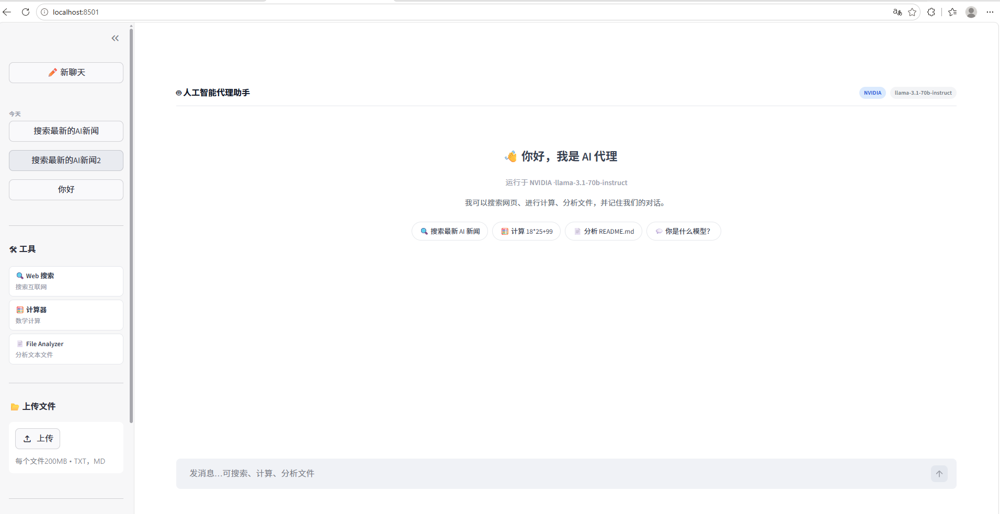
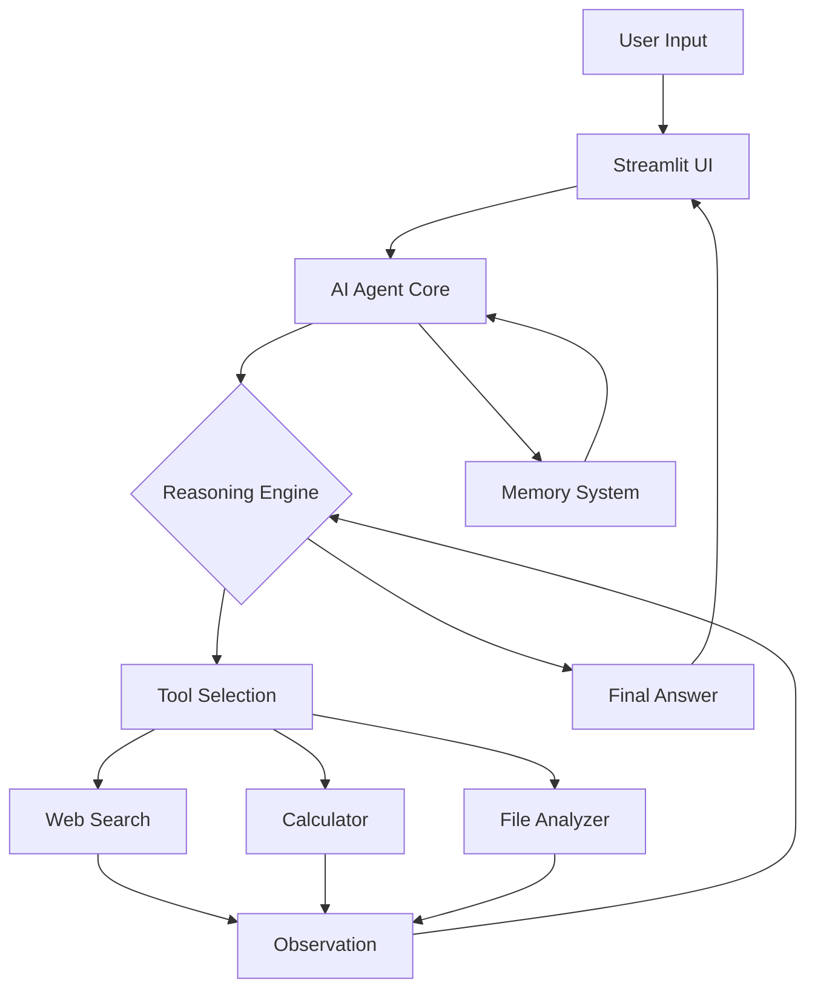

# 🤖 AI Agent Assistant

<div align="center">


**An intelligent multi-tool AI Agent with reasoning capabilities**

[Features](#-features) • [Installation](#-installation) • [Usage](#-usage) • [Architecture](#-architecture) • [Tools](#-tools)



</div>

---

## 📋 Overview

AI Agent Assistant is not just a chatbot—it's an intelligent agent that can **think**, **reason**, and **act** using various tools. Built with LangChain's ReAct (Reasoning + Acting) framework, it demonstrates how modern AI agents make decisions and solve complex tasks.

### What Makes This Different?

- **🧠 Transparent Reasoning**: See the agent's thought process in real-time
- **🛠️ Tool Integration**: Automatically selects and uses appropriate tools
- **💾 Contextual Memory**: Remembers conversation history and user information
- **⚡ Real-time Execution**: Watch the agent work through problems step-by-step

---

## ✨ Features

### 1. **Agent Reasoning System**
The agent follows a structured reasoning process:
- **Thought**: Analyzes what needs to be done
- **Action**: Selects the appropriate tool
- **Observation**: Processes tool results
- **Final Answer**: Provides a comprehensive response

### 2. **Multi-Tool Capabilities**

| Tool | Description | Example Use Case |
|------|-------------|------------------|
| 🔍 **Web Search** | Search the internet using DuckDuckGo | "Search for Python 3.14 new features" |
| 🧮 **Calculator** | Perform mathematical calculations | "Calculate 18*25+99" |
| 📄 **File Analyzer** | Read and analyze text files | "Summarize README.md" |

### 3. **Memory System**
- **Conversation History**: Maintains context across multiple turns
- **User Information**: Remembers user details (name, preferences, etc.)
- **Session Persistence**: Memory persists throughout the session

### 4. **Modern UI**
- Clean, ChatGPT-style interface
- Real-time reasoning visualization
- Tool status indicators
- Memory management controls

---

## 🚀 Installation

### Prerequisites
- Python 3.8 or higher
- Google Gemini API key (or DeepSeek API key)

### Step 1: Clone the Repository
```bash
git clone https://github.com/yourusername/AI-Agent-Assistant.git
cd AI-Agent-Assistant
```

### Step 2: Install Dependencies
```bash
pip install -r requirements.txt
```

### Step 3: Configure API Keys
1. Copy the example environment file:
```bash
cp .env.example .env
```

2. Edit `.env` and add your API key:
```env
GOOGLE_API_KEY=your_google_api_key_here
```

**Getting API Keys:**
- **Google Gemini**: Get your free API key at [Google AI Studio](https://makersuite.google.com/app/apikey)
- **DeepSeek** (alternative): Sign up at [DeepSeek Platform](https://platform.deepseek.com/)

---

## 💻 Usage

### Start the Application
```bash
streamlit run app.py
```

The app will open in your browser at `http://localhost:8501`

### Example Interactions

#### 1. Web Search
```
User: Search for the latest AI news
Agent: 
  💭 Thought: I need to search the web for current AI news
  ⚡ Action: Using WebSearch tool
  👁️ Observation: Found 5 recent articles...
  Final Answer: Here are the latest AI developments...
```

#### 2. Calculations
```
User: What is 18*25+99?
Agent:
  💭 Thought: This is a mathematical calculation
  ⚡ Action: Using Calculator tool
  👁️ Observation: Result: 549
  Final Answer: The result is 549
```

#### 3. File Analysis
```
User: Analyze the file notes.txt
Agent:
  💭 Thought: I need to read and analyze the file
  ⚡ Action: Using FileAnalyzer tool
  👁️ Observation: File contains 150 words...
  Final Answer: The file contains...
```

#### 4. Memory Usage
```
User: My name is 钱毛文
Agent: Nice to meet you, 钱毛文! I'll remember that.

[Later in conversation]
User: What's my name?
Agent: Your name is 钱毛文.
```

---

## 🏗️ Architecture

### Project Structure
```
AI-Agent-Assistant/
│
├── app.py                 # Streamlit UI application
├── agent_core.py          # Agent reasoning engine
├── memory.py              # Memory management system
│
├── tools/                 # Tool implementations
│   ├── search_tool.py     # Web search functionality
│   ├── calculator_tool.py # Mathematical calculations
│   └── file_tool.py       # File analysis
│
├── requirements.txt       # Python dependencies
├── .env.example          # Environment template
└── README.md             # Documentation
```

### Component Overview



### How It Works

1. **User Input**: User sends a query through the Streamlit interface
2. **Agent Processing**: The agent analyzes the query and determines if tools are needed
3. **Tool Execution**: If needed, the agent selects and executes appropriate tools
4. **Reasoning Loop**: The agent iterates through Thought → Action → Observation cycles
5. **Response Generation**: Once sufficient information is gathered, the agent provides a final answer
6. **Memory Update**: Conversation and user information are stored in memory

---

## 🛠️ Tools

### Web Search Tool
- **Provider**: DuckDuckGo (no API key required)
- **Capabilities**: Real-time web search, news, documentation
- **Results**: Top 5 results with titles, snippets, and URLs

### Calculator Tool
- **Operations**: +, -, *, /, ** (exponentiation)
- **Safety**: Sandboxed evaluation, no arbitrary code execution
- **Format**: Standard mathematical expressions

### File Analyzer Tool
- **Supported Formats**: .txt, .md, .markdown
- **Features**: 
  - File statistics (size, word count, line count)
  - Content preview (first 500 characters)
  - UTF-8 encoding support

---

## 🔧 Configuration

### Environment Variables

| Variable | Description | Required |
|----------|-------------|----------|
| `GOOGLE_API_KEY` | Google Gemini API key | Yes (if using Gemini) |
| `DEEPSEEK_API_KEY` | DeepSeek API key | Yes (if using DeepSeek) |
| `APP_TITLE` | Application title | No |
| `MAX_MEMORY_MESSAGES` | Max messages to store | No (default: 10) |

### Customization

#### Adding New Tools
1. Create a new tool file in `tools/` directory
2. Implement the tool function
3. Create a LangChain Tool wrapper
4. Register the tool in `app.py`

Example:
```python
# tools/my_tool.py
from langchain.tools import Tool

def my_function(input: str) -> str:
    # Your tool logic here
    return result

def create_my_tool() -> Tool:
    return Tool(
        name="MyTool",
        func=my_function,
        description="Description of what this tool does"
    )
```

#### Switching LLM Providers
To use DeepSeek instead of Gemini, modify `agent_core.py`:
```python
from langchain_openai import ChatOpenAI

llm = ChatOpenAI(
    model="deepseek-chat",
    openai_api_key=os.getenv("DEEPSEEK_API_KEY"),
    openai_api_base="https://api.deepseek.com/v1"
)
```

---

## 📊 Performance

- **Response Time**: 2-5 seconds (depending on tool usage)
- **Memory Usage**: ~200MB RAM
- **Token Efficiency**: Optimized prompts for cost-effective API usage

---

## 🤝 Contributing

Contributions are welcome! Here are some ways you can contribute:

- 🐛 Report bugs
- 💡 Suggest new features
- 🛠️ Add new tools
- 📝 Improve documentation
- 🎨 Enhance UI/UX

### Development Setup
```bash
# Clone the repo
git clone https://github.com/yourusername/AI-Agent-Assistant.git

# Create virtual environment
python -m venv venv
source venv/bin/activate  # On Windows: venv\Scripts\activate

# Install dependencies
pip install -r requirements.txt

# Run in development mode
streamlit run app.py
```

---

## 📝 License

This project is licensed under the MIT License - see the [LICENSE](LICENSE) file for details.

---

## 🙏 Acknowledgments

- **LangChain**: For the excellent agent framework
- **Streamlit**: For the intuitive UI framework
- **Google Gemini**: For powerful language model capabilities
- **DuckDuckGo**: For free web search API

---

## 📧 Contact

For questions or feedback:
- Create an issue on GitHub
- Email: your.email@example.com

---

<div align="center">

**Made with ❤️ by AI enthusiasts**

⭐ Star this repo if you find it helpful!

</div>
